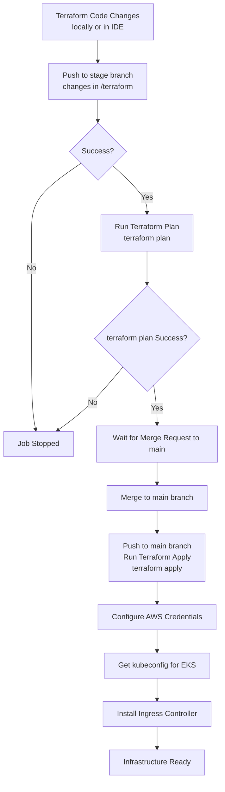

#🛠 E-RequestControl Infrastructure as Code (IaC)

Terraform-based infrastructure management for E-RequestControl application deployed on AWS EKS.

##🏗 Architecture Overview

This repository contains Terraform configurations to provision and manage the complete infrastructure for the E-RequestControl system on AWS, including EKS cluster, networking, security groups, and related resources.

##📊 Provisioning Workflow 

